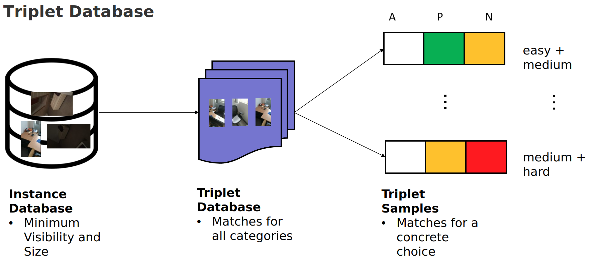
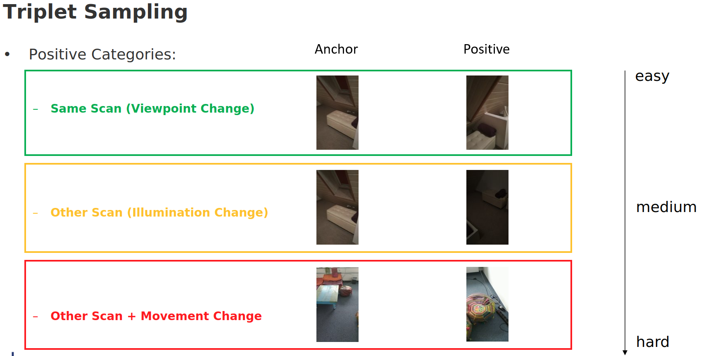
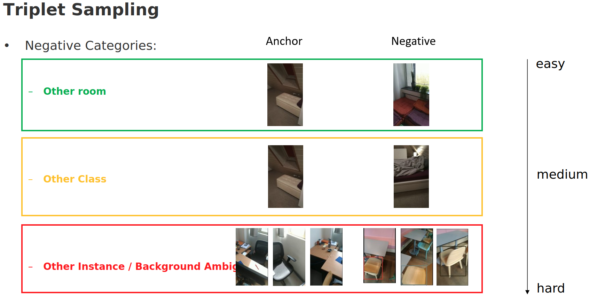

# 3RScan Triplet Dataset Toolkit

We provide a highly configurable PyTorch dataset / dataloader to use the 3RScan dataset for training and evaluation with
triplet networks. More information about the 3RScan dataset can be found here: https://github.com/WaldJohannaU/3RScan
We also provide sample model implementations that use this dataset.

From all rgb camera images of the scans in the 3RScan dataset, we select those images that are viable for training a triplet network based on filters:
- minimum size
- minimum visibility (occlusion+truncation of objects)
- class-filter (e.g. don't use images of walls)

These images get then combined into triplets (anchor, positive, negative) based on different positive and negative criteria (easy, medium, hard).



## Highlights

- Configurable sampling of triplets
    - 4 positive categories
    
    - 5 negative categories
    

- Minimum requirements for each sample (bounding-box size, visibility, etc.)

- Calculation of View-Point-Change and Illuminance-Difference between pairs of images

- Create offline databases for faster access of
    - Instances
    - Triplets of Instances
    - Transformation-Ratio and Illuminance-Difference between two instances
    
- Sample Models
    - re-OBJ (https://arxiv.org/abs/1909.07704)
    - Bounding-Box Encoder (+ R-MAC)
    - Receptive-Field Encoder
    - Full-Image Encoder
    - Multiple Backbones (VGG, ResNet) with multiple intermediate layers

- Complete Triplet-Loss Training Pipeline

- Evaluations
    - Offline Encoding-Database per model for faster access
    - Top-K accuracy + Top-K incorrect statistics (specifies the triplet accuracy)
    - Feature-Distance between anchor, positive and negative samples
    - Visualization (PCA, t-SNE) + Visualization-Database for faster access

## How to get started

- Download the 3RScan dataset (see: https://github.com/WaldJohannaU/3RScan)
- Optionally split the dataset into train/val/test with our custom splits (see: splits/*.txt)
- Render the 3RScan dataset with the Rio_Renderer (see: https://github.com/WaldJohannaU/3RScan/tree/master/c%2B%2B/rio_renderer). Make sure to include the rendering of the visibility.txt files!
- Run the FrameFilter component to generate the 2DInstances.txt file (see: util/FrameFilter)
- Create a conda environment with the requirements listed in requirements.txt

## How to train a model

- See the example Jupyter Notebook that uses the dataset components to train a sample model: notebooks/train.ipynb

## How to evaluate a model

- See the example Jupyter Notebook that uses the dataset components to test a sample model: notebooks/test.ipynb

## License and Citation

This framework is licensed under the MIT license. Please see `LICENSE.txt` for details.

If you use it in your research, we would appreciate a citation via
```bibtex
@misc{3rscan-triplet-dataset-toolkit,
    Author = {Lukas H\"ollein, Johanna Wald},
    Year = {2020},
    Note = {https://github.com/lukasHoel/3rscan-triplet-dataset-toolkit},
    Title = {3RScan Triplet Dataset Toolkit}
}
```
